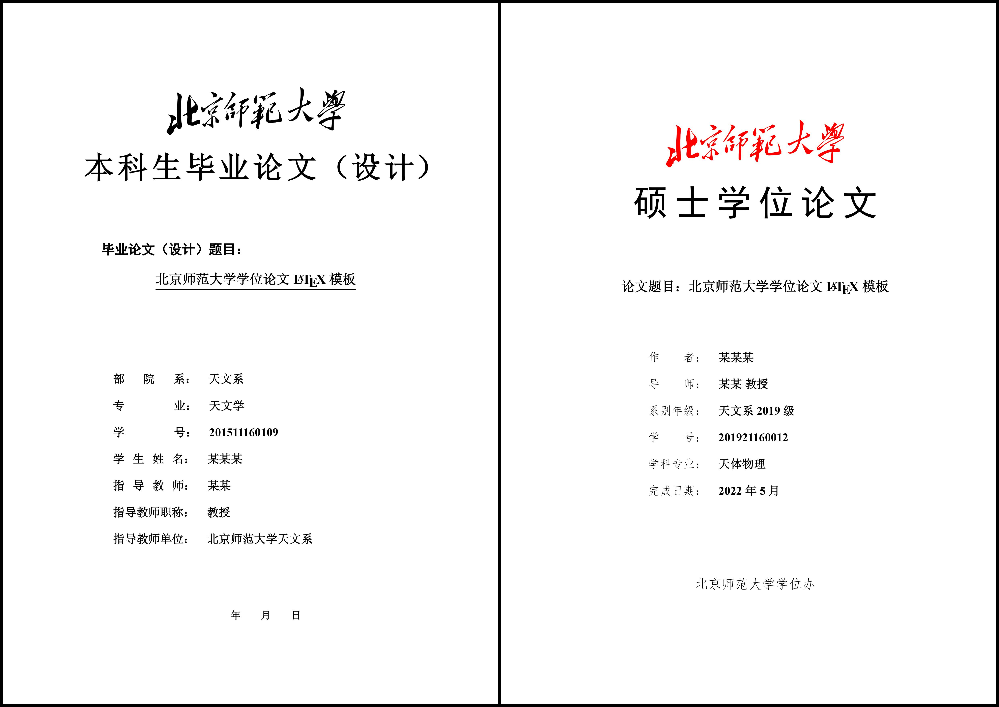

谢谢所有人的支持！目前学校已经有现成的论文模板，本模版就不再开发了。

# bnu-thesis-template

模板格式已通过图书馆审核。

北京师范大学学位论文模板，适用于本科生毕业论文（设计）、硕士学位论文、博士学位论文，基于[北师大学位论文Latex模板](http://gerry.lamost.org/blog/?p=811)和 GitHub 上的已有项目 [BNUBachelorThesis](https://github.com/xysmlx/BNUBachelorThesis) 修改。使用此模板需要先了解和掌握 Latex 和 Bibtex 基本知识，学习 Latex 可以参考北师大天文系余恒老师整理的 [LATEX 相关资源](http://202.112.85.96/wiki/doku.php/latex;resources)。

本模版在 MacBook 和 Windows 系统中均可成功编译。

论文模板已经上传 Overleaf Gallery，链接为 [BNU Bachelor/Master/PhD Thesis Template](https://www.overleaf.com/latex/templates/bnu-bachelor-slash-master-slash-phd-thesis-template/nhvczzkqtrqq)，因为模板发布需要审核，所以在 Overleaf 上的论文模板会比 GitHub 的模板落后一点。

### 编译说明

1. 使用 Texlive 2021 版本
2. 使用 XeLaTeX 编译引擎进行编译

### 待办事项

1. 博士学位论文需要书脊
2. 博士（硕士）学位论文的目录使用小二号黑体、参考文献使用四号黑体
3. 博士（硕士）学位论文要求发表学术论文列表与参考文献列表格式相同
4. 博士（硕士）学位论文可以使用顺序编码制、著者-出版年制两种著录方式
